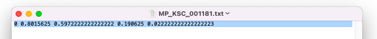

# Computer Vision Crosswalk Detection

## Objective: 
The objective to detect the crosswalk using the smartphone camera to help blind and visually impaired people to navigate safely in the traffic.

## Dataset: 
* We have a large dataset that contains more than 30000 crosswalks images and a .csv file that contains the image annotations: imagePath, image height, image width and the bounding box where the crosswalk is located (xmin, ymin, xmax, ymax).

## Models:
We have created 2 models:
1. Tensorflow Model 
2. Yolo V5 Model

## 1.Tensorflow Model from scratch

#### Model training:

This model can be found in [model_tensorflow.ipynb](https://github.com/JorgVervaet/Computer_Vision_Crosswalk_Detection/blob/main/model_tensorflow.ipynb).It has 17 layers, and can well predict the crosswalk location on the picture with crosswalk. 

To exclude bounding box prediction on non-crosswalk image, we have downloaded extra images of street view without crosswalk. We have added the values to the corresponding columns (xmin=0, ymin=0, xmax=0, ymax=0) in the annotations for these images.

The idea is that when there is a crosswalk, it will detect and predict the bounding box of the crosswalk. For image without crosswalk, it will make a tiny bounding box so that we can filter it out.

For running model_tensorflow you will need python 3.9.12 and can run this:
- `pip install -r tf_requirements.txt`

Below is some predictions using this model.\

## 2. Yolo V5 

### Data handling
- Input image labelling format 
YOLO labelling format requires one annotations text file per image. Each text file contains class name and one bounding-box (BBox) annotation for each of the objects in the image. The annotations are normalized to the image size, and lie within the range of 0 to 1. They are represented in the following format:
- `< object-class-ID> <X center> <Y center> <Box width> <Box height>`

Below is an example:\

The code for annotation handling can be reserved in yolo_transformer.ipynb.

- Data directories structure\

### Configuration files
The configurations for the training are divided to three YAML files and they were already provided with the YoloV5 tutorial itself. We have customized the yaml file (custom_data.yaml) to fit our project requirements.

### Training
We have a large data set with 30000+ images. Following [the offical tutorial](https://colab.research.google.com/github/ultralytics/yolov5/blob/master/tutorial.ipynb), we have split the data into train,validation and test. 

We set our training commands as below:
- `!python train.py --img 640 --batch 20 --epochs 5 --data /content/yolov5/data/custom_data.yaml --weights yolov5s.pt --cache`

* batch — batch size. Use the largest batch size that your hardware allows for.
* epochs — number of epochs
* data — path to the data-configurations file
* cfg — path to the model-configurations file
* weights — path to initial weights
* cache — cache images for faster training
* img — image size in pixels

### Validation

We have used the validation script to see if our model predict good. Performances can be evaluated over the training, validation or test dataset splits.

### Inference
After we got our model with good training performances, we apply inference for image and videos. This model can predict good even on rainbow crosswalk, and also on the crosswalk with extra object on it.

Below are some examples.

### Save model
We saved our model to the common PyTorch convention with ‘.pt’ file extension.

## Authors of this project : 
* [Himanshu Pardhi](https://github.com/Himanshu-pardhi)
* [Yihui Wang](https://github.com/yhwang0123)
* [Jorg Vervaet](https://github.com/JorgVervaet)